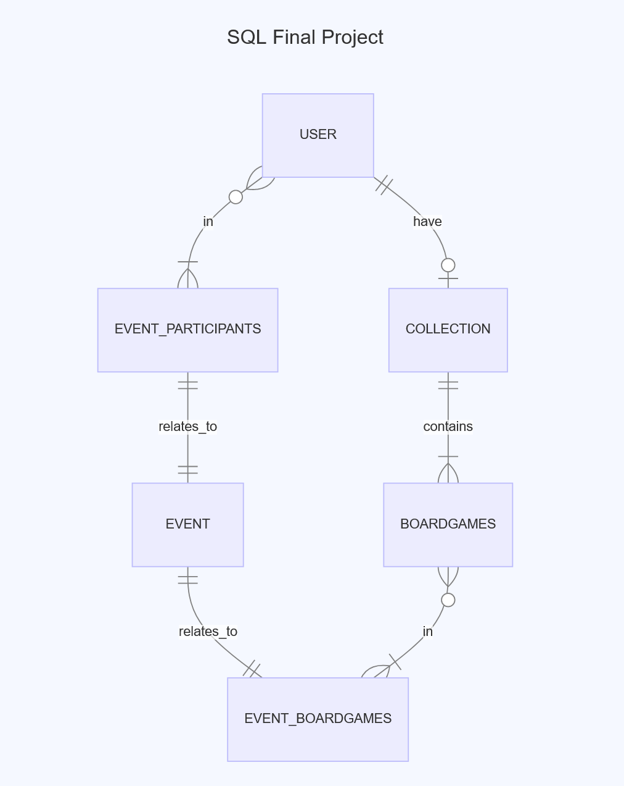

# Design Document

By Jaroslaw Zabkiewicz

Video overview: <https://www.youtube.com/watch?v=crzQx-5QT9I>

## Scope

The database for CS50 SQL contains most of the entities necessary to ensure the best possible storage of board games events that could be used, for example, in a web application. The scope of the database is:

* Users - board gamers, including their basic information such as names, cities, player status, etc.
* Events - board games events, including their basic information, type, status, etc.
* Board games - basic information about games.
* Collections - stores users collection of games and basic information about them, such as date added, whether it is their favorite game or not, sessions played, etc.
* Event boardgames - storing information about what board games will be available at the event.
* Event participants - storing information about who will attend the event.

## Functional Requirements

User will be able to implement this database into a working web application to store information related to boardgames, boardgamers and the occuring events.

* User can store above informations by using SQL queries (examples in queries.sql file) written in their web-app with the use of python, flask, html, css, javascript etc.

* Large scale event management is beyond the scope of a given database.

## Representation

Entities are captured in SQLite tables with the following schema.

### Entities

The database includes the following entities:

#### Users

The `users` table includes:

* `id`, which specifies the unique ID for user as an `INTEGER`. This column has the `PRIMARY KEY` constraint.
* `username`, which specifies the users username as `TEXT`.
* `first_name`, which specifies the users first name as `TEXT`.
* `last_name`, which specifies the users last name as `TEXT`.
* `city`, which specifies the users city name as `TEXT`.
* `email`, which specifies the users email name as `TEXT`.
* `password`, which specifies the users password as `TEXT`, password is hashed.
* `organization`, which specifies the users organization if he belongs to any as `TEXT`.
* `status`, which specifies the users status as `TEXT`. User has to specify themselves from one the statuses provided as either `player`, `local host` or `event organizer`.

All columns in the `users` table are required and have the `NOT NULL` constraint applied except the organization which is optional and can be added later.

#### Events

The `events` table includes:

* `id`, which specifies the unique ID for event as an `INTEGER`. This column has the `PRIMARY KEY` constraint.
* `name`, which specifies the event name as `TEXT`.
* `start_date`, which specifies the event starting date as `NUMERIC`.
* `end_date`, which specifies the event ending date as `NUMERIC`.
* `location`, which specifies the event location as `TEXT`.
* `host_id`, which specifies the event host as `TEXT`, this also has `FOREIGN KEY` constraint and references to `users` table `id`.
* `type`, which specifies the event type as `TEXT`. Has to be one of two options available - `local` or `away`.
* `status`, which specifies the event status as `TEXT`. Has to be one of three options available - `upcoming`, `active`, `ended`.
* `registrations`, which specifies whether the users can register for event or not as `TEXT`. It is either false or true therefor it has the `CHECK` constraint `BETWEEN` 0 `AND` 1.

All columns in the `events` table are required and have the `NOT NULL` constraint applied.

#### Boardgames

The `boardgames` table includes:

* `id`, which specifies the unique ID for boardgame as an `INTEGER`. This column has the `PRIMARY KEY` constraint.
* `title`, which specifies the boardgame title as `TEXT`.
* `publisher`, which specifies the boardgame publisher as `TEXT`.
* `players`, which specifies the boardgame player limit as `TEXT`.
* `cover_image`, which specifies the boardgame cover image as `BLOB`.
* `description`, which specifies the boardgame short description as `TEXT`.

Only `title` column in the `boardgames` table is required and has the `NOT NULL` constraint applied. Everything else is optional.

#### Collections

The `collections` table includes:

* `id`, which specifies the unique ID for row as an `INTEGER`. This column has the `PRIMARY KEY` constraint.
* `user_id`, which is a user id specified as `INTEGER` and related to the user id from the `users` table by `FOREIGN KEY` constraint.
* `bg_id`, which is a boardgame id specified as `INTEGER` and related to the boardgame id from the `boardgames` table by `FOREIGN KEY` constraint.
* `ownership`, which is specified as `NUMERIC` and has a `CHECK` constraint and `BETWEEN` 0 `AND` 1 which is a soft deletion in case someone removes the game from their collection.
* `add_date`, which is a date that the user added game to their collection as `NUMERIC`, it also has a `DEFAULT` constraint `CURRENT_TIMESTAMP` in case user don't specify the exact date it was bought.
* `sessions_played`, which specifies the number of sessions the game was played as `INTEGER`, mainly for statistics usage. It also has a `DEFAULT` constraint set to 0 when game is added to the collection.
* `favourite`, which specifies whether the game is one of the favourites or not as `NUMERIC`, also has a `CHECK` constraint and `BETWEEN` 0 `AND` 1 for either false or true, `DEFAULT` constraint sets the the status to false.

The columns in the `collections` table that are required to have the `NOT NULL` constraint applied are `ownership`, `add_date`, `sessions_played` and `favourite`. Everything else is gathered from related tables using `FOREIGN KEY`.

#### Event boardgames

The `event_boardgames` table includes:

* `id`, which specifies the unique ID for row as an `INTEGER`. This column has the `PRIMARY KEY` constraint.
* `event_id`, which specifies the event id as `INTEGER` and is related to the `events` table by using `FOREIGN KEY` constraint.
* `user_id`, which specifies the user id as `INTEGER` and is related to the `users` table by using `FOREIGN KEY` constraint.
* `bg_id`, which specifies the boardgame id as `INTEGER` and is related to the `boardgames` table by using `FOREIGN KEY` constraint.

It is a junction table that gathers info from other tables that are related by `FOREIGN KEY` constraints.

#### Event participants

The `event_participants` table includes:

* `id`, which specifies the unique ID for row as an `INTEGER`. This column has the `PRIMARY KEY` constraint.
* `event_id`, which specifies the event id as `INTEGER` and is related to the `events` table by using `FOREIGN KEY` constraint.
* `user_id`, which specifies the user id as `INTEGER` and is related to the `users` table by using `FOREIGN KEY` constraint.

It is a junction table that gathers info from other tables that are related by `FOREIGN KEY` constraints.

### Relationships

The below entity relationship diagram describes the relationships among the entities in the database used by single user.

As detailed by the diagram:

* One user is capable of making 1 collection of boardgames but can have none as well. A collection can be related to only 1 user, cannot be shared. Table `collections` can hold many collections of games but each can be related to only 1 user.

* Certain collection can have 1 or many boardgames. Boardgames can be added by user to 1 and only 1 collection. (In other terms boardgames can be a part of many collections but in this preview we specify only single user process.)

* Event boardgames list can contain 0 or many boardgames, boardgames can be a part of 1 or many lists, because there can be many events occuring on different date.

* Event can be related to 1 and only 1 event boardgames list. Additionally event_participants list can be related to 1 and only 1 event as well.

* Event_participants list can contain 0 or many users that signed up for certain event. Users can sign to 1 or many lists because there can be many events occuring on different date.

## Optimizations

Per the typical queries in `queries.sql`, it is common for users of the database to view everyone who is participating in a certain event and their names, lastnames. For that reason, indexes are created on the `username`, `first_name`, `last_name` columns in the `users` table to speed the identification of users by those columns.

Similarly, it is also common practice for a user of the database to search for events. As such, an index is created on the `name`, `location`, `type,` and `status` column in the `events` table to speed the identification of problems by name.

Users will also search through their collections of boardgames which is why index is created on the `user_id`, `bg_id` columns in the `collections` table to speed up the queries.

Similarly, users will search through all boardgames in the database when adding to their collections so index is created on the `title` column in the `boardgames` table to speed up the process.

## Limitations

Limitation is mainly about scaling of the project, it needs improvements to store host bigger, more detailed data, their relationships and statistics.
